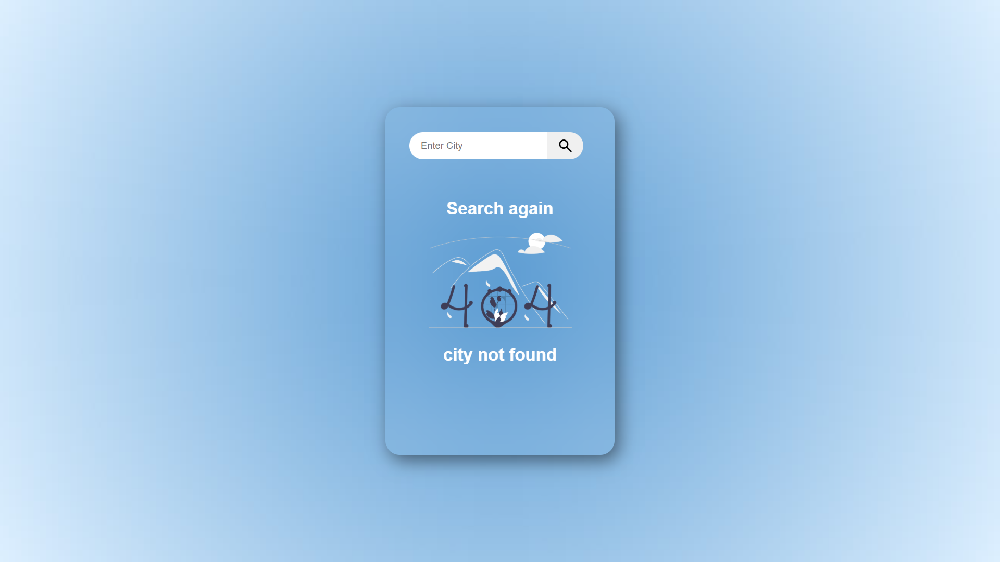
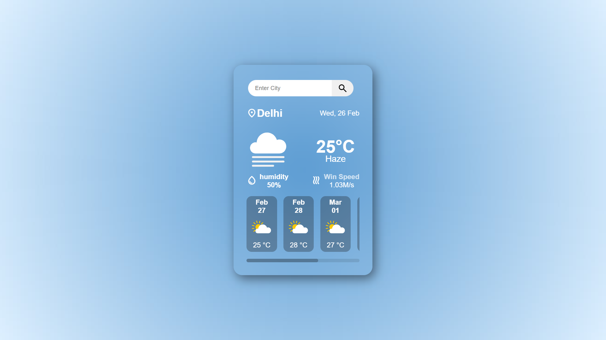

🌤 Weather-Web

A simple Weather App built using HTML, CSS, JavaScript, and the OpenWeather API. This app allows users to enter a city name and get real-time weather details, including temperature, humidity, wind speed, and a 3-day forecast.

🚀 Features

🌎 Search for real-time weather of any city.

🌡️ Displays temperature, weather conditions, humidity, and wind speed.

📅 Shows a 3-day forecast with weather icons.

🔍 Error handling: Displays "City Not Found" if the city doesn't exist.

🎨 Responsive UI with a modern glassmorphism design.

📸 Screenshots

1️⃣ Initial View

User sees a clean interface with a search box and prompt.

2️⃣ Weather Found

After entering a valid city, detailed weather information is displayed.

3️⃣ City Not Found

If an invalid city name is entered, an error message appears.

🛠️ Technologies Used

HTML - Structure of the app

CSS - Styling (Glassmorphism UI)

JavaScript - Logic and API handling

OpenWeather API - Fetching weather data

⚡ How to Use

Clone the repository:

git clone https://github.com/your-username/weather-app.git

Open index.html in a browser.

Enter a city name in the search box and hit the search button.

View the weather details or error message if the city is not found.